# LLM Trader — Master Architecture Blueprint

> **Repository:** [https://github.com/qrak/LLM_trader.git](https://github.com/qrak/LLM_trader.git)
> **Python:** 3.13, `.venv/`, `python start.py`
> **Status:** BETA / Research Edition — paper-trading mode only
> **Live Dashboard:** [https://semanticsignal.qrak.org](https://semanticsignal.qrak.org)

---

## 0. Instruction Authority

Root `AGENTS.md` is the single instruction source of truth in this repository across all IDEs, agents, and harnesses.

- Root `AGENTS.md` is canonical for system-wide rules, architecture, coding standards, testing, terminal behavior, and governance.
- IDE-specific instruction files are non-authoritative and should not contain policy that is missing from `AGENTS.md`.
- `.github/workflows/*` defines CI execution behavior, not instruction authority.

---

## 1. System Overview

**SEMANTIC SIGNAL LLM (LLM Trader)** is an autonomous, asyncio-first trading bot that converts market data, news (via RAG), and chart images into structured BUY / SELL / HOLD decisions via large language models. The system operates a **distributed multi-agent intelligence architecture**: specialized agents for technical analysis, pattern recognition, news retrieval, risk validation, outcome-aware learning, and reflection-based rule synthesis — all coordinated through a central trading loop.

```mermaid
flowchart TB
    subgraph External["External Layer"]
        EX["Exchanges<br/>(Binance, KuCoin, Gate.io,<br/>MEXC, Hyperliquid)<br/>&#8209; CCXT"]
        CG["CoinGecko<br/>DeFiLlama"]
        ALT["Alternative.me<br/>(Fear & Greed)"]
        RSS["RSS Feeds<br/>(CoinDesk, CoinTelegraph,<br/>Decrypt, CryptoSlate)"]
        AI_PROV["AI Providers<br/>Google Gemini (primary)<br/>LM Studio (local text fallback)<br/>OpenRouter (secondary configurable provider)"]
    end

    subgraph DataIngestion["Data Ingestion Layer"]
        DF["DataFetcher<br/>OHLCV + Order Book + Trade Flow"]
        RAG["RAG Engine Agent<br/>News + Fundamentals"]
    end

    subgraph AnalysisLayer["Analysis Layer"]
        TA["Analysis Engine Agent<br/>Technical Calculator<br/>50+ Indicators"]
        PE["Pattern Engine<br/>Deterministic Indicator<br/>Pattern Detection<br/>Numba JIT compiled"]
        CGEN["Chart Generator<br/>4K PNG Candlestick<br/>SMA/RSI/Volume/CMF+OBV"]
    end

    subgraph BrainLayer["Learning & Memory Layer"]
        BRAIN["🧠 Brain Agent<br/>TradingBrainService"]
        VM["Vector Memory<br/>ChromaDB<br/>Trade Experiences<br/>Semantic Rules<br/>Confidence Stats"]
        REFL["Reflection Engine<br/>Best‑practice Rules<br/>Anti‑patterns<br/>AI Mistake Rules"]
    end

    subgraph RiskLayer["Risk & Execution Layer"]
        RP["Risk Manager<br/>Dynamic SL/TP<br/>Position Sizing"]
        GP["Order Governance Pipeline<br/>Symbol Guard<br/>Max Size Guard"]
        STRAT["Trading Strategy<br/>Exit Monitor<br/>Position Status Monitor"]
    end

    subgraph Output["Output Layer"]
        DASH["📊 Dashboard<br/>FastAPI + WebSocket"]
        LOGS["Audit Trail<br/>Position Logs<br/>SQLite Trade History"]
    end

    subgraph Providers["Provider Orchestration"]
        PO["Provider Orchestrator<br/>Fallback Chain"]
    end

    %% Data Flow
    EX --> DF
    RSS --> RAG
    CG --> RAG
    ALT --> TA
    DF --> TA
    TA --> PE
    TA --> CGEN
    
    RAG --> TA
    TA --> PO
    PO --> AI_PROV
    
    AI_PROV -->|"Structured Signal"| RP
    RP --> GP
    GP --> STRAT
    
    STRAT -->|"Closed Trade"| BRAIN
    BRAIN --> VM
    VM -->|"Reflection Loop"| REFL
    REFL -->|"Rules"| VM
    VM -->|"Context Injection"| BRAIN
    BRAIN -->|"Confidence + Rules"| TA
    
    TA --> DASH
    STRAT --> DASH
    STRAT --> LOGS
```



---

## 2. Agent Inventory

| # | Agent Name | Primary Responsibility | Core Model | Core Implementation |
|---|------------|----------------------|------------|---------------------|
| 1 | **🧠 Brain Agent** (TradingBrainService) | Outcome-aware decision enricher, semantic rule learning via reflection loops, confidence calibration | Deterministic/vector memory; context is injected into provider-routed LLM prompts | [`src/trading/brain.py`](./src/trading/brain.py) |
| 2 | **🔬 Analysis Engine Agent** | Market data collection, 50+ technical indicators, pattern recognition, chart generation, AI signal synthesis | Gemini 3.6 Flash (multimodal) | [`src/analyzer/analysis_engine.py`](./src/analyzer/analysis_engine.py) |
| 3 | **📰 RAG Engine Agent** | News aggregation (RSS + Crawl4AI), fundamentals (DeFiLlama), relevance scoring, context retrieval | Deterministic (no LLM) | [`src/rag/rag_engine.py`](./src/rag/rag_engine.py) |
| 4 | **⚙️ Risk Manager Agent** | Dynamic SL/TP scaling, position sizing, signal validation, circuit breakers | Deterministic | [`src/managers/risk_manager.py`](./src/managers/risk_manager.py) |
| 5 | **☁️ Provider Orchestrator** | AI provider lifecycle, multi-provider fallback chain, parameter negotiation | — | [`src/managers/provider_orchestrator.py`](./src/managers/provider_orchestrator.py) |
| 6 | **🛡️ Governance Pipeline** | Pre-execution guard chain: symbol whitelist, max position size | Deterministic | [`src/trading/guards/pipeline.py`](./src/trading/guards/pipeline.py) |
| 7 | **📊 Dashboard Agent** | Real-time FastAPI + WebSocket monitoring, performance analytics, brain state inspection | — | [`src/dashboard/server.py`](./src/dashboard/server.py) |

---

## 3. Application Lifecycle

### 3.1 Startup (CompositionRoot)

`start.py` → `SingleInstanceLock` → Event loop with `GracefulShutdownManager` → 9-stage dependency provisioning:

| Stage | Provisioner | Dependencies Created |
|-------|------------|---------------------|
| 1 | `_provision_infrastructure` | ExchangeManager, aiohttp session, KeyboardHandler |
| 2 | `_provision_utilities` | FormatUtils, UnifiedParser, TokenCounter, TimeframeValidator, CategoryCollisionResolver |
| 3 | `_provision_platforms` | CCXTMarketAPI, CoinGecko, Alternative.me, DeFiLlama, RSS/Crawl4AI news client |
| 4 | `_provision_rag_layer` | RagEngine, NewsManager, LocalTaxonomyProvider, TickerManager |
| 5 | `_provision_model_layer` | AI provider clients, ProviderOrchestrator, ModelManager |
| 6 | `_provision_analyzer_layer` | AnalysisEngine, MarketDataCollector, TechnicalCalculator, PatternAnalyzer |
| 7 | `_provision_trading_layer` | TradingStrategy, ExitMonitor, VectorMemoryService, TradingStatisticsService, TradingBrainService |
| 8 | `_provision_notifiers` | Discord notifier with DiscordFileHandler, or console fallback notifier |
| 9 | `_provision_dashboard_layer` | DashboardServer, DashboardState, force_analysis_event |

**Architectural invariant:** All services are instantiated in the composition layer and injected via constructor parameters. **Never** construct service dependencies inside other service classes, and **never** use in-function lazy imports (`Pylint C0415`) to resolve circular dependency cycles—refactor constructor parameter injection at the CompositionRoot (`start.py`) instead.

### 3.2 Main Loop

```
AnalysisEngine.analyze_market()
  ├── MarketDataCollector → DataFetcher (OHLCV + order book + trade flow)
  ├── TechnicalCalculator (50+ indicators) + LongTerm data + Weekly macro
  ├── PatternAnalyzer → IndicatorPatternEngine (deterministic indicator-pattern kernels)
  ├── ChartGenerator (4K PNG) → LLM visual chart-pattern analysis (via analysis_result_processor.py)
  ├── RAG context retrieval
  ├── Brain context injection (confidence + rules similar to current conditions)
  ├── AI provider call → TradingAnalysisResponseModel (prompt includes step 5.5 invalidation check:
  │      model must name a specific invalidation trigger or HOLD)
  └── Structured dict returned to TradingStrategy
       ↓
TradingStrategy.process_analysis()
    ├── PositionExtractor + UnifiedParser → extract and validate signal
    ├── GuardPipeline (symbol → max size)
    ├── RiskManager → RiskAssessment (SL/TP scaling, computes R:R)
    ├── TradingStrategy → R:R minimum check against max(config floor, brain floor; both default 0.0)
    ├── OrderLifecycle → INTENT → READY_FOR_REVIEW → EXECUTED (or REJECTED)
    ├── Approval is recorded as an audit event, not as an OrderLifecycle state
    ├── PersistenceManager → SQLite-only trade_history.db append (no JSON fallback/migration)
    ├── RiskManager friction drain → store_blocked_trade feedback for brain learning
    └── ExitMonitor (dual-mode: soft at candle close; hard at configurable interval per SL/TP type)
       └── PositionStatusMonitor → background asyncio loop with dynamic rescheduling
       ↓
BrainAgent.update_from_closed_trade()
  ├── BrainExperienceRecorder → store vector memory
  ├── trade_count++ → schedule reflection if interval reached
  └── ReflectionEngine → sequential: best-practice → anti-pattern → AI-mistake rules
```

### 3.3 Shutdown

`GracefulShutdownManager` handles:
- SIGINT/SIGTERM → drain active analysis → persist state → close providers → flush logs
- Keyboard handler → manual stop with state preservation

---

## 4. Core Data Flow

### 4.1 Decision Cycle

```
┌──────────────┐    ┌──────────────────────┐    ┌───────────────────┐
│  DataFetcher  │───▶│   AnalysisEngine     │───▶│  ProviderOrch.    │
│  (CCXT/API)   │    │  TechCalc + Pattern  │    │  (Fallback Chain) │
└──────────────┘    │  Chart + RAG + Brain  │    └────────┬──────────┘
                    └──────────────────────┘             │
                                    ▲                    ▼
                                    │           ┌──────────────────┐
                                    │           │   UnifiedParser   │
                                    │           │  → TradingSignal  │
                                    │           └────────┬──────────┘
                                    │                    ▼
                                    │           ┌──────────────────┐
                                    │           │  GuardPipeline   │
                                    │           │  3 Guards (pass?)│
                                    │           └────────┬──────────┘
                                    │                    ▼
                                    │           ┌──────────────────┐
                                    │           │   RiskManager    │
                                    │           │  SL/TP/Size/R:R  │
                                    │           └────────┬──────────┘
                                    │                    │
                                    │                    ▼
                                    │           ┌──────────────────────┐
                                    │           │ TradingStrategy      │
                                    │           │ R:R check (min 1.5)  │
                                    │           │ + ExitMonitor        │
                                    │           └────────┬─────────────┘
                                    │                    │
                                    │                    ▼ (on close)
                                    │           ┌──────────────────────┐
                                    └───────────│   BrainAgent         │
                                                │  Experience +        │
                                                │  Reflection + Rules  │
                                                └──────────────────────┘
```

### 4.2 Learning Loop

```
Closed Trade ──▶ BrainExperienceRecorder ──▶ ChromaDB (vector memory)
                                                   │
                                                   ├── Update matched semantic-rule validation/contradiction counters
                                                   │
                          trade_count % interval == 0
                                                   │
                                                   ▼
                                          ReflectionEngine
                                          ├── Best-practice rules
                                          ├── Anti-pattern rules
                                          └── AI-mistake rules
                                                   │
                                                   ▼
                                          Next Cycle: BrainContextProvider
                                          queries ChromaDB for:
                                          - Similar past trades (top-5)
                                                                                    - Relevant rules (matched to conditions,
                                                                                        scored by similarity + evidence + timeframe freshness)
                                          - Confidence stats by level
                                          - Blocked trade feedback
                                                   │
                                                   ▼
                                          Injected into LLM prompt
```

Semantic-rule policy:
- Active semantic rules are durable learned policy and are not deleted by age-only pruning.
- Rule influence is soft-ranked by semantic similarity, evidence quality, timeframe-aware freshness, contradiction count, and **surprise ratio** (see below).
- Closed trades that match active rules update validation or contradiction metadata for later ranking.
- **Surprise ratio** (`|realized P&L - expected P&L| / expected P&L`) is computed at trade close. A high surprise ratio (>1.5) means the outcome was driven by factors outside the entry thesis — the trade won despite flawed reasoning (or lost despite good reasoning). Rules derived from high-surprise trades carry a `⚠️ high surprise` annotation in their rule text, allowing the LLM to discount lucky outcomes when forming policy.
- Inactive old rules may be physically pruned as storage maintenance; active rules should be deactivated by evidence, not age.

### 4.3 Trade Persistence

- Trade history is SQLite-only at `data/trading/trade_history.db` via `SQLiteTradeHistory` and `PersistenceManager`.
- Runtime code must not read, write, or auto-migrate `trade_history.json`.
- `PersistenceManager.save_trade_decision()` fails loudly if SQLite persistence fails; do not add JSON fallback paths.
- Dashboard, brain entry-decision lookup, and query scripts must consume trade history through injected persistence or SQLite APIs.
- Historical `.json.migrated` files are backups only, not runtime inputs.
- **Zero Backward Compatibility & Startup Clutter Policy**:
  - Runtime code in `src/` and `start.py` must remain 100% clean, canonical, and clutter-free.
  - Never introduce inline schema migration `ALTER TABLE` statements, legacy unit conversion methods, rule migration hooks (`refresh_semantic_rules_if_stale`), or `try/except` fallback paths into runtime service initialization.
  - Never add `sys.path.insert(0, ...)` manipulation hacks into `start.py`.
  - Never include startup auto-rehydration loops in `start.py`. Any database or vector storage rehydrations/conversions MUST be executed explicitly via standalone CLI scripts (e.g., in `scripts/`), after which the script is executed once and deleted.
  - **Classes Only in `src/utils/`**: All utility concerns across `src/utils/` and `app.py` must be encapsulated as a Class (e.g., `JournalRotator`, `TokenCounter`). Standalone utility functions are strictly forbidden.

---

## 5. Configuration

Active config at `config/config.ini`. Key settings:

| Setting | Value |
|---------|-------|
| **Pair** | BTC/USDC (USD Coin) |
| **Timeframe** | 4h |
| **Candles** | 999 (125 for AI chart) |
| **Capital** | $10,000 simulated |
| **Fee** | 0.075% |
| **Max Position** | 10% of portfolio |
| **Fallback sizes** | 1% / 2% / 3% (LOW/MEDIUM/HIGH confidence) |
| **News update** | Every 4 hours, 5 articles max |
| **Model** | Google Gemini 3.6 Flash (provider=`googleai`), OpenRouter base model `google/gemini-3-flash-preview`, OpenRouter fallback `deepseek/deepseek-r1:free` |
| **Dashboard** | 0.0.0.0:8000 |

---

## 6. Project Structure Reference

```
LLM_trader/
├── start.py                     # Entry point + CompositionRoot
├── AGENTS.md                    # THIS FILE — single master architecture blueprint & rules
├── README.md                    # Project overview, setup, roadmap
├── CHANGELOG.md                 # Version history
├── requirements.txt / -dev.txt
├── keys.env / keys.env.example  # Secrets
├── config/
│   ├── config.ini               # Active configuration
│   ├── model_pricing.json       # Per-model cost data
│   └── rag_priorities.json      # Category/generic RAG priority config (important_categories + generic_priorities)
├── src/
│   ├── app.py                   # Main application wiring
│   ├── trading/                 # 🧠 Brain Agent + Strategy + Monitors
│   │   ├── brain.py             # TradingBrainService (facade)
│   │   ├── brain_*.py           # 5 collaborators
│   │   ├── trading_strategy.py  # Strategy orchestration
│   │   ├── exit_monitor.py      # Hard/soft exit checks
│   │   ├── vector_memory.py     # ChromaDB interface
│   │   ├── vector_memory_*.py   # Analytics, rules, context (3 collaborators)
│   │   ├── regime_risk_profile.py # Regime-aware risk profile selector (Risk Manager)
│   │   ├── statistics.py        # P&L tracking
│   │   └── guards/              # 🛡️ Governance Pipeline
│   ├── analyzer/                # 🔬 Analysis Engine
│   │   ├── analysis_engine.py   # Orchestrator
│   │   ├── technical_calculator.py # 50+ indicators
│   │   ├── pattern_engine/      # Chart + indicator patterns
│   │   ├── prompts/             # System prompt construction
│   │   ├── formatters/          # Context formatting (4 non-init source modules)
│   │   ├── data_fetcher.py      # Exchange data abstraction
│   │   └── ...                  # 15+ supporting modules
│   ├── rag/                     # 📰 RAG Engine
│   │   ├── rag_engine.py        # Orchestrator
│   │   ├── news_manager.py      # News lifecycle
│   │   ├── news_ingestion/      # RSS + Crawl4AI
│   │   └── ...                  # 15+ supporting modules
│   ├── managers/                # ⚙️ Risk Manager + ☁️ Provider Orchestrator
│   │   ├── risk_manager.py      # Signal safety layer
│   │   ├── persistence_manager.py # Position/state facade + SQLite trade history access
│   │   ├── sqlite_trade_history.py # SQLite-only trade history store
│   │   ├── provider_orchestrator.py  # AI fallback chain
│   │   └── model_manager.py     # Model lifecycle
│   ├── dashboard/               # 📊 Dashboard
│   │   ├── server.py            # FastAPI app
│   │   └── routers/             # 7 API routers
│   ├── indicators/              # Indicator library — 50+ Numba functions
│   ├── platforms/               # AI providers + exchange APIs
│   ├── parsing/                 # UnifiedParser
│   ├── logger/                  # Structured logging
│   ├── notifiers/               # Discord, console, file
│   └── utils/                   # Profiler, token counter, etc.
├── tests/                       # 89 test_*.py files + conftest.py
├── data/                        # Runtime state (not committed)
├── logs/                        # Rotated daily log output
│   └── Bot/                     # Logger name (defined in logger init)
│       └── YYYY_MM_DD/          # One folder per day
│           ├── Bot.log          # Full structured log (all levels)
│           └── errors.log       # Error-level only log
├── scripts/                     # Cross-platform startup scripts
│   └── install_agent_terminal_guard.ps1 # Optional session-local PowerShell literal ^U guard
├── src/*/AGENTS.md              # Per-area agent docs (analyzer, trading, trading/guards, indicators,
│                                # managers, rag, dashboard) plus src/AGENTS.md — each links back here
```

---

## 7. Active Platform Integrations

- **Exchanges:** Binance, KuCoin, Gate.io, MEXC, Hyperliquid (via CCXT)
- **Market Data:** CoinGecko, Alternative.me, DeFiLlama, CCXT exchange market data
- **AI Providers:** Google AI (primary — Gemini 3.6 Flash), LM Studio (local text fallback), OpenRouter (secondary provider with configurable base + fallback models)
- **News Sources:** CoinDesk, CoinTelegraph, Decrypt, CryptoSlate, RSS feeds with Crawl4AI enrichment

---

## 8. Operational Rules

Use this root `AGENTS.md` as the canonical source for all global standards and agent policies.

### Terminal Guardrails (All Agents)

- Send one terminal command per tool call.
- Never include control-key text in commands (for example `^U`, `^C`, `^[`).
- On Windows/PowerShell in VS Code, prompt-edit control text such as `^U` is sent literally and becomes part of the command name. Do not assume Linux/readline behavior.
- Never send terminal follow-up probes or marker echoes (for example `Write-Output $LASTEXITCODE`, `echo DONE`, or a "flush" command) to recover hidden or truncated validation output.
- If validation output is incomplete, either trust the user's visible terminal output when provided or rerun the exact validation command once with a generous timeout.
- `scripts/install_agent_terminal_guard.ps1` can be dot-sourced as a session-local safety net for accidental literal `^U` prefixes; it is not a substitute for clean commands.
- Never chain validation commands with `;`, `&&`, variable assignment, redirect/capture, and readback in one line.
- For pytest validation, trust only raw output from a direct pytest command.
- If terminal output is empty or malformed, do not claim success.
- Never infer pass/fail from a trailing `PYTEST_EXIT` marker when earlier commands in that same line failed.

### Operator Commands

Keep platform-specific setup, startup, test, lint, and type-check commands in `README.md`.
This file documents agent architecture and execution policy only.

### Safety

- **Paper trading only** — real exchange order execution not implemented
- **Hard SL/TP exits** are configured at 15-minute intervals; soft candle-close exits are supported by ExitMonitor
- **Max position:** 10% of portfolio
- **Simulated capital:** $10,000 with 0.075% fee model
- **Fail-closed behavior** if governance/risk validation cannot decide safely

---

## 9. Documentation Governance

### AGENTS-Only Policy Checklist

Use this checklist for every documentation or tooling-policy PR:

1. All behavioral policy changes are documented in root `AGENTS.md`.
2. Do not introduce IDE-specific policy files (for example Copilot, Claude, or Windsurf instruction docs) as authoritative guidance.
3. `.github/workflows/*` may define CI execution logic only; workflow comments must not replace policy documentation in `AGENTS.md`.
4. If a command, validation rule, or safety guard changes, update the related AGENTS section in the same PR.
5. Before merge, run a repository search to ensure no stale references point to removed tool-specific instruction files.

### Drift Prevention Rule

- Any new tool-specific instruction file must be a non-authoritative pointer to `AGENTS.md`; if it contains independent policy, it should be rejected in review.

---

## 10. Code Conventions (all areas)

**No comments in code — docstrings only.** Reasoning belongs in the commit message, the change description, or this file; a `#` comment in `src/`, `tests/` or `scripts/` is deleted on sight. The only tolerated comments are machine directives (`# noqa`, `# type: ignore`). Code must explain itself: precise names, small functions, real types.

### Architecture
- **Dependency injection only.** Every class receives its dependencies (`logger`, `config`, collaborators) through `__init__`; the single composition root is `start.py`. Never construct a collaborator inside a method.
- **`self.logger`, never `self._logger`** — `@retry_async` reads `instance.logger`.
- **No standalone functions in `app.py`**, and no loose helper modules: every concern is a class wired once from `start.py`. Utility code lives in `src/utils/` as classes, not as functions inside submodules.
- **Top-level imports only.** An in-function import added to dodge a circular import means the wiring is wrong — fix it in the composition root.
- **No `sys.path` manipulation and no startup auto-rehydration loops** in `start.py`; one-off data conversions run as a script that is executed once and deleted.

### Types and data
- `TradeDecision` and `Position` are `@dataclass(slots=True)` with fixed fields: access attributes directly. Never `hasattr` / `getattr` / `isinstance` on them.
- Raw payloads from LLM output or API responses are `dict | None`: read them with `.get()`, and keep the guards that protect genuinely unknown data.
- `TradeDecision` carries no `order_type` / `reduce_only`; those come from `ENTRY_ORDER_TYPE` and `analysis.get("reduce_only", False)`.
- Validate numbers at the boundary: NaN/Inf are rejected where they enter (`_parse_finite_number`, `_parse_finite_float`, `math.isfinite` for timestamps), and `serialize_for_json` maps NaN/Inf to `None`.
- `SerializableMixin.from_dict(to_dict(obj))` must round-trip nested tuples and datetimes.

### Errors and retries
- Narrow exception handling. A bare `except:` never exists; a broad `except Exception` is a deliberate fail-open or fail-closed decision that the docstring explains. Never fix a bug by catching and ignoring.
- Every queue eviction is logged with context; every `asyncio.gather` handles per-task exceptions explicitly instead of swallowing them.
- No hand-rolled retry loops: `@retry_async` (`src/utils/decorators.py`) for network and exchange calls, `@retry_api_call` for AI provider calls.
- `time.sleep` has no place in async code; the only acceptable sleeper is `_interruptible_sleep`.

### Performance
- Optimize only against measured evidence — never prematurely, never at the cost of readability: a clear 10% win beats an opaque 15% win.
- Keep an optimization self-contained (well under 50 lines), behavior-preserving, and safe under the asyncio event loop and thread concurrency.
- Ask before adding a dependency, changing queue sizes or thread boundaries, touching the core trading loop (`app.py`, `start.py`), or changing ChromaDB collection schemas and embedding logic.

### Dead code
- **Zero compatibility leftovers.** Delete dead endpoints, cache prefixes, CSS, DOM ids, aliases and retired guards immediately; git history is the archive.
- The decision wire format (signal names, payload fields) is a contract: never change it silently.

## 11. Security Conventions

- Secrets live in `keys.env` / `.env` only (gitignored): never in `.py`, never in a log. Follow the redaction pattern (`_redact_private_key()`); never log credentials, private keys or full secret payloads.
- Any `eval` / `exec` / `subprocess(shell=True)` / `os.system` / `pickle.loads` / `yaml.load` hit in `src/` is CRITICAL until proven otherwise.
- Validate input with FastAPI/Pydantic models (`Field`, `Path`, `Query`) instead of hand-parsing dicts; errors must never leak sensitive data.
- Use the established patterns: PBKDF2-SHA256 password hashing, HMAC-SHA256 signed cookies, `hmac.compare_digest` for comparisons, constant-time anti-enumeration on login, `/admin` and `/api/admin` gated to LAN behind admin auth, DOMPurify for every dynamic HTML string.
- A security change is done only when you have exercised the attack vector and shown it fails; report severity, the vulnerable location, the concrete impact, the fix and the proof.
- Ask before changing authentication or authorization logic, session-cookie formats, admin middleware, or rate limiting on `/api/admin/login`.

## 12. Change Workflow & Verification Gates

1. **Reproduce before fixing.** A bug you cannot reproduce is a bug you cannot verify.
2. **One change, one purpose.** Never refactor and fix in the same change; keep the diff minimal and behavior identical beyond the stated fix.
3. **Fast gate first:** `py_compile` the touched files, `ruff check src/`, `python -c "import start"`, then the targeted file `pytest tests/<matching>.py -x -q`.
4. **Full gate before claiming done:** `pytest tests/ -q` with 0 failures, and `pyright src start.py` with no new errors.
5. **Test isolation:** delete `position_state.json` / `position_state.json.tmp` before a suite, or point `state_path` at a temp directory; a test double must never default to a live state file or a live journal path.
6. **A bug fix ships with a regression test**, added to the existing test file for that module rather than a new one.
7. **Read the diff after every edit:** a patch that matched the wrong anchor relocates or truncates code silently.
8. **Never commit or push without explicit user consent.** Run the suite first; commit only with 0 failures.
9. **Do not touch CI configuration** (`.github/workflows/`, test/lint settings) unless asked.
10. Known pre-existing noise, never caused by your change: 3 admin Playwright tests and 8 collection errors (NumPy/Numba constraint, stale import), plus 18 pre-existing `BLE001`/`S110` hits in `tests/{test_admin_live,test_admin_playwright,test_shutdown_real}.py` — `ruff check src start.py scripts` is the gate that must be clean.

## 13. Package Maps (read on demand)

Root `AGENTS.md` is canonical for system-wide rules. Package detail lives next to the code, in per-directory `AGENTS.md` files, so a task reads only the map it needs:

| Area | Detail file | Covers |
|---|---|---|
| Cross-cutting `src/` contracts (parsing, utils, notifiers, platforms, logger) | [`src/AGENTS.md`](./src/AGENTS.md) | Module regression contracts for packages without their own file |
| Trading brain, strategy, monitors, position management | [`src/trading/AGENTS.md`](./src/trading/AGENTS.md) | TradingBrainService, vector memory, strategy flow, exits |
| Order governance pipeline (guards) | [`src/trading/guards/AGENTS.md`](./src/trading/guards/AGENTS.md) | Guard chain, fail-closed policy |
| Analysis engine | [`src/analyzer/AGENTS.md`](./src/analyzer/AGENTS.md) | Data collection, indicators, prompts, chart vision |
| Indicator library | [`src/indicators/AGENTS.md`](./src/indicators/AGENTS.md) | Numba JIT functions |
| Managers | [`src/managers/AGENTS.md`](./src/managers/AGENTS.md) | Risk, persistence, SQLite history, providers |
| RAG engine | [`src/rag/AGENTS.md`](./src/rag/AGENTS.md) | News ingestion, retrieval, priorities |
| Dashboard | [`src/dashboard/AGENTS.md`](./src/dashboard/AGENTS.md) | FastAPI app, routers, static UI |

When a change touches one of these areas, read that file before editing; when the rule you need is missing there, add it to the area file rather than growing this one.
